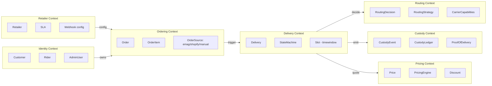
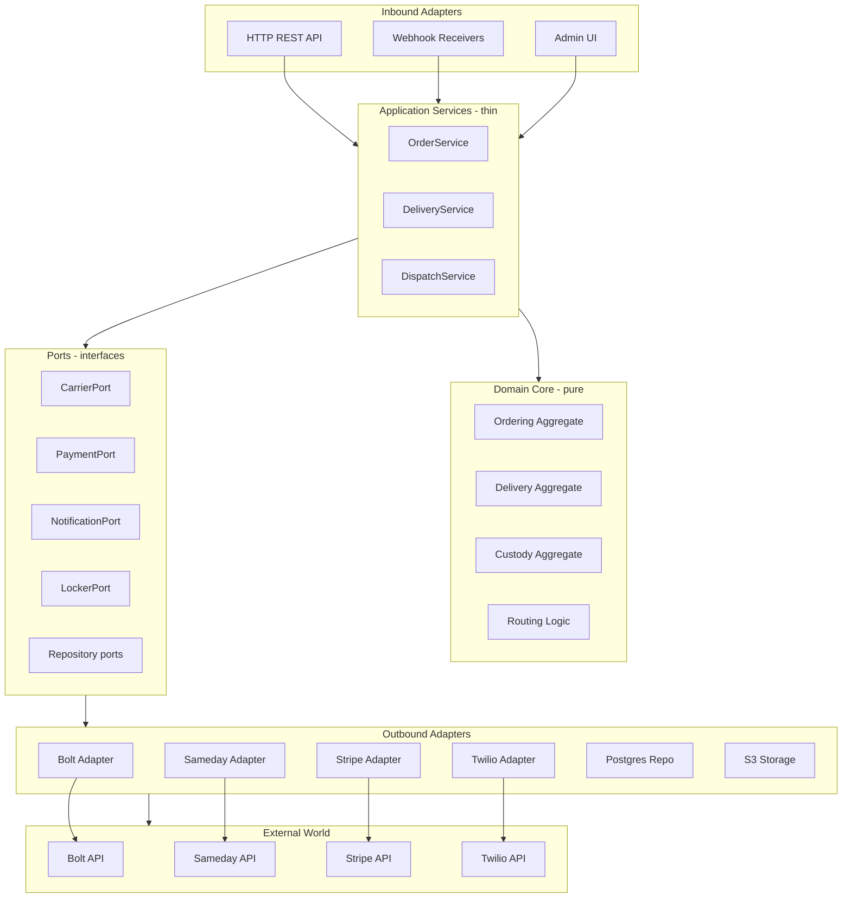
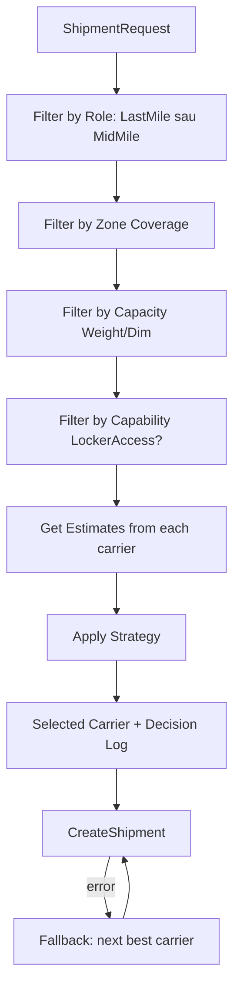
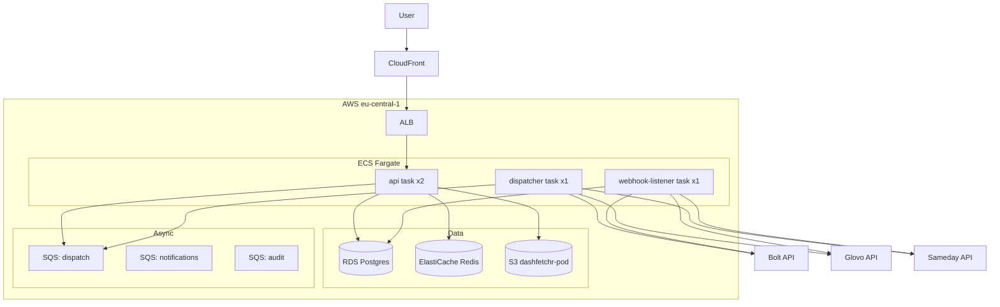

# DashFetchr — Technical Architecture

**Version**: 1.0
**Status**: In review
**Audience**: Tech Lead, Backend Engineers, DevOps
**Last updated**: 2026-05-14

---

## Cuprins

1. [Principii arhitecturale](#1-principii-arhitecturale)
2. [Bounded Contexts (DDD)](#2-bounded-contexts-ddd)
3. [Hexagonal Architecture — Ports & Adapters](#3-hexagonal-architecture--ports--adapters)
4. [Carrier Integration Pattern](#4-carrier-integration-pattern)
5. [Chain of Custody Ledger](#5-chain-of-custody-ledger)
6. [Database Schema](#6-database-schema)
7. [Event-Driven Backbone](#7-event-driven-backbone)
8. [Routing Engine](#8-routing-engine)
9. [Stack tehnic detaliat](#9-stack-tehnic-detaliat)
10. [Securitate & Compliance](#10-securitate--compliance)
11. [Deployment & Infrastructure](#11-deployment--infrastructure)
12. [Observability](#12-observability)
13. [Testing strategy](#13-testing-strategy)

---

## 1. Principii arhitecturale

| Principiu | Aplicare concreta |
|---|---|
| **Core domain decuplat** | `internal/core/*` nu importa **niciodata** din `internal/adapters/*`. Enforcement prin `go-arch-lint` in CI. |
| **Single source of truth pentru evenimente** | Toate schimbarile de stare trec prin `custody.Ledger`. Append-only, hash-chained. |
| **Adaugarea unui carrier nu modifica core** | Implementezi `CarrierPort`, inregistrezi in registry, gata. Vezi [ADDING_A_CARRIER.md](ADDING_A_CARRIER.md). |
| **Failure-first design** | Tot ce iese din proces (carrier API, DB, S3) poate esua. Retry-uri, circuit breaker, idempotency keys peste tot. |
| **Idempotency** | Toate endpoint-urile critice (CreateOrder, CreateShipment, RecordEvent) accepta `Idempotency-Key`. Duplicate sunt no-op. |
| **Audit by default** | Orice mutatie produce un eveniment audit. Folosim event sourcing partial pentru Delivery + Custody. |
| **Modulith pana la 10+ ingineri / 100k req/zi** | Apoi sparge in microservicii pe granitele bounded contexts existente — care e *toata ideea* DDD-ului. |

---

## 2. Bounded Contexts (DDD)

Mapezi domeniul in contexte cu limbaje **proprii** (ubiquitous language per context). Comunica prin contracts explicite, nu prin model partajat.



### Context relationships

- **Ordering → Delivery**: Customer/Supplier (Delivery e downstream, primeste ordin)
- **Delivery → Custody**: Conformist (Custody accepta orice eveniment, fara push-back)
- **Delivery → Routing**: Partnership (decid impreuna best carrier)
- **Carrier Adapters → Core**: Anti-Corruption Layer (translate carrier types into domain types)

---

## 3. Hexagonal Architecture — Ports & Adapters

### Diagrama de izolare



### Regula de aur

> **Domain core (`internal/core/*`) nu poate importa nimic in afara de:**
> - Standard library
> - Alte module din `internal/core/*`
> - `internal/ports/*`
>
> **Niciodata** nu importa `internal/adapters/*` sau `internal/infra/*`.

Enforcement automat in CI:

```yaml
# .go-arch-lint.yml
deps:
  core:
    canUse: [stdlib, core, ports]
    cannotUse: [adapters, infra, cmd]
```

---

## 4. Carrier Integration Pattern

### 4.1 The CarrierPort interface

```go
package ports

import "context"

type CarrierPort interface {
    Capabilities() CarrierCapabilities
    CreateShipment(ctx context.Context, req ShipmentRequest) (*ShipmentResponse, error)
    GetShipmentStatus(ctx context.Context, externalID string) (*ShipmentStatus, error)
    CancelShipment(ctx context.Context, externalID string, reason string) error
    GetEstimate(ctx context.Context, req EstimateRequest) (*Estimate, error)
    ParseWebhook(ctx context.Context, raw []byte, headers map[string]string) ([]DomainEvent, error)
}
```

5 metode. Pentru orice carrier, le implementezi. Dosaru' adapter nu trebuie sa **stie** ce sunt celelalte carriers, nici cum sunt folosite in core.

### 4.2 Capabilities pattern

Routing engine-ul **NU** are knowledge de Bolt sau Glovo. Stie doar sa intrebe *"care carrier suporta X?"*:

```go
type CarrierCapabilities struct {
    ID              CarrierID         // "bolt_food"
    Name            string            // "Bolt Food Romania"
    Roles           []CarrierRole     // LastMile, MidMile
    MaxWeightKg     float64
    MaxDimensionsCm [3]float64
    Zones           []GeoZone         // geometrii GeoJSON
    DeliveryModes   []DeliveryMode    // Instant, Scheduled
    PickupModes     []PickupMode      // Address, Locker, Hub
    POD             []ProofType       // Photo, GPS, Signature
    SLA             SLA               // AvgPickupTime, AvgDeliveryTime
    SupportsLocker  bool              // Poate accesa easybox-uri?
    AuthScheme      AuthScheme
    APIRateLimit    RateLimit
    Quirks          []string          // free-form notes
}
```

### 4.3 Anti-Corruption Layer

Fiecare carrier are propriul `mapper.go` care e **singurul** punct de contact intre formatul lor si al nostru:

```go
package bolt

// Tot ce e "Bolt" trebuie sa stea aici, nu sa scape in alte pachete.
type BoltMapper struct {
    serviceArea string
}

func (m *BoltMapper) ToBoltRequest(r ports.ShipmentRequest) BoltCreateOrderRequest {
    return BoltCreateOrderRequest{
        // ... map cu nume Bolt-specifice
    }
}

func (m *BoltMapper) FromBoltStatus(s BoltStatus) ports.ShipmentStatus { ... }

func (m *BoltMapper) ToDomainEvents(wh BoltWebhookPayload) []ports.DomainEvent { ... }
```

Daca Bolt schimba un field name in API, modifici **un singur fisier**. Nimic altceva.

### 4.4 Registry pattern

```go
// internal/carrier/registry.go
type Registry struct {
    mu       sync.RWMutex
    carriers map[CarrierID]map[string]CarrierPort  // ID -> version -> impl
}

func (r *Registry) Register(version string, c CarrierPort) error { ... }
func (r *Registry) Get(id CarrierID, version string) (CarrierPort, error) { ... }
func (r *Registry) ListByRole(role CarrierRole) []CarrierPort { ... }
func (r *Registry) ListInZone(zone GeoZone, role CarrierRole) []CarrierPort { ... }
```

Inregistrarea la startup:

```go
func wire(cfg Config) *Registry {
    r := carrier.NewRegistry()
    r.Register("v1", bolt.New(cfg.Bolt))
    r.Register("v1", glovo.New(cfg.Glovo))
    r.Register("v1", sameday.New(cfg.Sameday))
    return r
}
```

Adaugare carrier nou = **o linie** in wire-up. Plus implementarea adapter-ului propriu.

### 4.5 Versionarea adapter-elor

Live multiple versions simultan:

```go
r.Register("v1", bolt.NewV1(cfg))
r.Register("v2", bolt.NewV2(cfg))  // Bolt schimba API
```

Feature flag in DB:

```sql
INSERT INTO carrier_routing_config (carrier_id, version, rollout_percent)
VALUES ('bolt_food', 'v2', 10);  -- 10% traffic on v2
```

Bumpezi la 100% cand e stabil. Daca apar erori, dai rollback la `v1` fara redeploy.

---

## 5. Chain of Custody Ledger

### 5.1 Event model

```go
type CustodyEvent struct {
    EventID       uuid.UUID
    DeliveryID    uuid.UUID
    SequenceNum   int64           // pozitia in chain
    Type          EventType
    OccurredAt    time.Time       // server NTP-synced
    CarrierTime   *time.Time      // ce zice carrier-ul (poate fi skewed)
    Actor         Actor           // rider/system/customer + carrier_id
    Location      *GeoPoint       // lat, lng, accuracy_m, alt
    Photos        []PhotoRef      // S3 URI + sha256 + EXIF preserved
    Signature     *SignatureRef   // optional, S3 URI
    Reason        *string         // pentru failures
    Metadata      json.RawMessage // free-form
    PrevEventHash string          // hash event precedent
    Hash          string          // hash(prev_hash || canonical_payload)
}
```

### 5.2 Hash chain (tamper-evident)

```
Event N hash = SHA256(
    Event N-1 hash
    || canonical_json(Event N payload, sorted keys, no whitespace)
)
```

Verificare integritate periodica (job zilnic):

```go
func (l *Ledger) Verify(ctx context.Context, deliveryID uuid.UUID) error {
    events := l.repo.ListByDelivery(ctx, deliveryID)
    var prev string
    for i, e := range events {
        if e.PrevEventHash != prev {
            return ErrChainBroken{At: i, Event: e.EventID}
        }
        if e.Hash != computeHash(prev, e) {
            return ErrTampered{At: i, Event: e.EventID}
        }
        prev = e.Hash
    }
    return nil
}
```

### 5.3 Photo storage

- Bucket S3: `dashfetchr-pod-prod`
- Object Lock: **Compliance mode**, 7 ani
- Encryption: SSE-KMS cu CMK rotational
- Path: `pod/{year}/{month}/{delivery_id}/{event_id}.jpg`
- Metadata stored alongside: SHA256, EXIF (GPS), uploader (rider_id), carrier_id
- Pre-signed URLs pentru upload (rideri) si download (admin) — niciodata acces public
- Thumbnail generation pe upload (Lambda trigger), pentru dashboard

### 5.4 GPS verification

La fiecare event, validam:
- `accuracy_m < 100` (altfel low_confidence flag)
- Pentru `rider.arrived_at_locker`: distanta ≤ 50m de locker (geofencing)
- Pentru `package.delivered`: distanta ≤ 30m de adresa client
- Daca esueaza geofence → manual review queue in admin dashboard

---

## 6. Database Schema

Vezi [migrations/](../migrations/) pentru SQL complet. Tabelele principale:

### 6.1 Tabele core

```sql
-- Retailerii integrati
CREATE TABLE retailers (
    id UUID PRIMARY KEY,
    name TEXT NOT NULL,
    slug TEXT UNIQUE NOT NULL,
    api_key_hash TEXT NOT NULL,
    settings JSONB NOT NULL DEFAULT '{}',
    sla JSONB NOT NULL DEFAULT '{}',
    created_at TIMESTAMPTZ NOT NULL DEFAULT NOW()
);

-- Clientii finali (din PWA / WhatsApp)
CREATE TABLE customers (
    id UUID PRIMARY KEY,
    phone_e164 TEXT UNIQUE NOT NULL,
    email TEXT,
    name_encrypted BYTEA,  -- PII criptat
    address_default JSONB,
    created_at TIMESTAMPTZ NOT NULL DEFAULT NOW()
);

-- AWB intern DashFetchr (normalizat peste toate carrier-urile)
CREATE TABLE awbs (
    id UUID PRIMARY KEY,
    internal_awb TEXT UNIQUE NOT NULL,        -- ex: DF-2026-A1B2C3
    retailer_id UUID NOT NULL REFERENCES retailers(id),
    customer_id UUID REFERENCES customers(id),
    external_awbs JSONB NOT NULL DEFAULT '[]', -- [{"carrier":"sameday","awb":"..."}]
    package JSONB NOT NULL,                    -- weight, dims, declared_value
    state TEXT NOT NULL,                       -- created, at_locker, ...
    created_at TIMESTAMPTZ NOT NULL DEFAULT NOW(),
    updated_at TIMESTAMPTZ NOT NULL DEFAULT NOW()
);

CREATE INDEX idx_awbs_state ON awbs(state) WHERE state NOT IN ('delivered','cancelled');
CREATE INDEX idx_awbs_external_awb ON awbs USING gin (external_awbs);

-- Deliveries (cursa concreta, poate fi parte din mai multe legs)
CREATE TABLE deliveries (
    id UUID PRIMARY KEY,
    awb_id UUID NOT NULL REFERENCES awbs(id),
    leg_number INT NOT NULL,                   -- 1=mid-mile, 2=last-mile
    carrier_id TEXT NOT NULL,                  -- "bolt_food", "sameday"
    carrier_external_id TEXT,                  -- ID-ul lor pentru cursa
    pickup JSONB NOT NULL,                     -- lat,lng,address,type=locker|address
    drop JSONB NOT NULL,
    scheduled_window TSTZRANGE,                -- intervalul ales de client
    state TEXT NOT NULL,
    rider JSONB,                               -- nullable, populated dupa assign
    price_quoted_minor INT NOT NULL,           -- in bani (RON cents)
    price_charged_minor INT,
    created_at TIMESTAMPTZ NOT NULL DEFAULT NOW(),
    updated_at TIMESTAMPTZ NOT NULL DEFAULT NOW(),
    UNIQUE (awb_id, leg_number)
);

CREATE INDEX idx_deliveries_state ON deliveries(state);
CREATE INDEX idx_deliveries_carrier ON deliveries(carrier_id, state);

-- Custody events (append-only, hash chained)
CREATE TABLE custody_events (
    event_id UUID PRIMARY KEY,
    delivery_id UUID NOT NULL REFERENCES deliveries(id),
    sequence_num BIGINT NOT NULL,
    type TEXT NOT NULL,
    occurred_at TIMESTAMPTZ NOT NULL,
    carrier_time TIMESTAMPTZ,
    actor JSONB NOT NULL,
    location JSONB,
    photos JSONB NOT NULL DEFAULT '[]',
    signature JSONB,
    reason TEXT,
    metadata JSONB,
    prev_hash TEXT NOT NULL,
    hash TEXT NOT NULL,
    UNIQUE (delivery_id, sequence_num)
);

-- Append-only: trigger care interzice UPDATE/DELETE
CREATE OR REPLACE FUNCTION prevent_modification() RETURNS trigger AS $$
BEGIN
    RAISE EXCEPTION 'custody_events is append-only';
END;
$$ LANGUAGE plpgsql;

CREATE TRIGGER no_update_custody BEFORE UPDATE OR DELETE ON custody_events
    FOR EACH ROW EXECUTE FUNCTION prevent_modification();

-- Routing decisions audit
CREATE TABLE routing_decisions (
    id UUID PRIMARY KEY,
    delivery_id UUID NOT NULL REFERENCES deliveries(id),
    strategy TEXT NOT NULL,                    -- "cheapest", "fastest", etc
    candidates JSONB NOT NULL,                 -- carrier list + scores
    chosen JSONB NOT NULL,
    reasoning TEXT,
    decided_at TIMESTAMPTZ NOT NULL DEFAULT NOW()
);
```

### 6.2 Carrier-specific

```sql
CREATE TABLE carrier_credentials (
    carrier_id TEXT PRIMARY KEY,
    encrypted_creds BYTEA NOT NULL,            -- KMS-wrapped
    sandbox BOOLEAN NOT NULL DEFAULT FALSE,
    rotated_at TIMESTAMPTZ NOT NULL DEFAULT NOW()
);

CREATE TABLE carrier_routing_config (
    carrier_id TEXT NOT NULL,
    version TEXT NOT NULL,
    rollout_percent INT NOT NULL DEFAULT 0 CHECK (rollout_percent BETWEEN 0 AND 100),
    enabled BOOLEAN NOT NULL DEFAULT TRUE,
    updated_at TIMESTAMPTZ NOT NULL DEFAULT NOW(),
    PRIMARY KEY (carrier_id, version)
);

CREATE TABLE carrier_webhooks_inbox (
    id UUID PRIMARY KEY,
    carrier_id TEXT NOT NULL,
    received_at TIMESTAMPTZ NOT NULL DEFAULT NOW(),
    signature_valid BOOLEAN NOT NULL,
    raw_body BYTEA NOT NULL,
    headers JSONB NOT NULL,
    processed_at TIMESTAMPTZ,
    error TEXT,
    delivery_id UUID                            -- populated dupa parsing
);

CREATE INDEX idx_webhooks_unprocessed ON carrier_webhooks_inbox(carrier_id, received_at) 
    WHERE processed_at IS NULL;
```

---

## 7. Event-Driven Backbone

### 7.1 Event types

```go
type DomainEvent interface {
    EventType() string
    AggregateID() string
    OccurredAt() time.Time
}

// Exemple
type DeliveryCreated struct{ ... }
type DeliveryAssignedToCarrier struct{ ... }
type RiderArrivedAtPickup struct{ ... }
type PackagePickedUp struct{ ... }
type PackageDelivered struct{ ... }
type DeliveryFailed struct{ ... }
```

### 7.2 Event bus

- **v1 (MVP)**: SQS — fiecare consumer un queue dedicat
- **v2**: Kafka cu Schema Registry — multi-consumer, replay

```go
type EventBus interface {
    Publish(ctx context.Context, e DomainEvent) error
    Subscribe(eventType string, h Handler) error
}
```

### 7.3 Consumeri

| Consumer | Subscribes to | What it does |
|---|---|---|
| `notification-service` | `DeliveryCreated`, `RiderAssigned`, `PackageDelivered` | Trimite WhatsApp/SMS |
| `audit-service` | `*` (all) | Persists in audit_log table |
| `analytics-service` | `*` | Bulk insert ClickHouse |
| `retailer-webhook-service` | `PackageDelivered`, `DeliveryFailed` | Notifica retailerul |
| `payment-finalizer` | `PackageDelivered` | Capture payment, release escrow |

### 7.4 Idempotency

Toate eventele au `EventID` UUID. Consumerii implementeaza idempotency prin `INSERT ON CONFLICT DO NOTHING` cu `event_id` ca PK in tabela de tracking.

---

## 8. Routing Engine

### 8.1 Decizia

Pentru o cursa noua, routing engine-ul executa:



### 8.2 Strategy interface

```go
type RoutingStrategy interface {
    Name() string
    Select(ctx context.Context, req DeliveryRequest, candidates []Candidate) (Selection, error)
}

type Candidate struct {
    Carrier  CarrierPort
    Estimate ports.Estimate
    Health   CarrierHealth   // success_rate, avg_delay, recent_errors
}

type Selection struct {
    Carrier   CarrierPort
    Reasoning string
    Score     float64
    Considered []ScoredCandidate
}
```

### 8.3 Strategii implementate

| Strategy | Logic | Cand se foloseste |
|---|---|---|
| `CheapestStrategy` | Min(estimate.cost) | Budget-conscious retailers |
| `FastestStrategy` | Min(estimate.eta) | Premium retailers |
| `RetailerPolicyStrategy` | Citeste preferinta retailerului | Default in v1 |
| `WeightedScoreStrategy` | `cost*w1 + eta*w2 + (1-success_rate)*w3` | v2 default |
| `MLStrategy` | Model trained pe events istorice | v3 |

### 8.4 Decision logging

Fiecare decizie e salvata in `routing_decisions` cu candidatii considerati + scorurile. Asta e:
- Audit trail
- Training data pentru ML
- Debugging cand un retailer cere *"de ce a mers la Bolt si nu la Glovo?"*

---

## 9. Stack tehnic detaliat

### 9.1 Backend

| Componenta | Choice | Version | De ce |
|---|---|---|---|
| Language | Go | 1.22 | Concurrency, latenta mica, type safety |
| HTTP framework | `chi` | v5 | Minimal, idiomatic, middleware ecosystem |
| ORM/Query | `sqlc` + `pgx` | latest | Type-safe SQL, no magic, performant |
| Validation | `go-playground/validator` | v10 | Standard |
| Logging | `slog` (stdlib) | 1.22 | Structured, low overhead |
| Tracing | OpenTelemetry | latest | Vendor-neutral |
| Testing | `testify` + `testcontainers` | latest | Asserts + real Postgres in tests |
| Migrations | `golang-migrate` | latest | Standard, version-controlled |
| Background jobs | `river` (Postgres-based) | latest | Single DB, transactional, simple |

### 9.2 Frontend

| Componenta | Choice | De ce |
|---|---|---|
| Framework | Next.js 14 (App Router) | SSR, route handlers, PWA |
| Styling | Tailwind CSS | Velocity, design system rapid |
| Components | shadcn/ui | Accessible, customizable |
| State | Zustand / React Query | Simpler than Redux |
| Forms | react-hook-form + zod | Type-safe validation |
| Maps | Mapbox GL JS | CEE-friendly, ieftin la scale |

### 9.3 Infrastructure

| Componenta | Choice | De ce |
|---|---|---|
| Cloud | AWS (eu-central-1 Frankfurt) | Cea mai apropiata regiune, GDPR |
| Compute | ECS Fargate | No K8s overhead pentru o echipa mica |
| DB | RDS PostgreSQL 16 + read replica (M6+) | Managed, backup automat |
| Cache | ElastiCache Redis | Standard, manageable |
| Queue | SQS + SNS | Native, ieftin |
| Storage | S3 + CloudFront | Standard |
| KMS | AWS KMS | PII encryption, S3 SSE |
| Secrets | AWS Secrets Manager | Rotation built-in |
| CI/CD | GitHub Actions → ECS | Standard |
| IaC | Terraform | Standard |

### 9.4 Third party

| Serviciu | Use | Status |
|---|---|---|
| Stripe | Plata internationala | v1 |
| Netopia | Plata locala (RO cards) | v1 |
| Twilio | SMS | v1 |
| WhatsApp Business API (via 360dialog sau Twilio) | Notificari principale | v1 |
| Mapbox | Geocoding, maps | v1 |
| Sentry | Error tracking | v1 |
| Posthog (self-hosted) | Product analytics | v1 |
| Datadog | Metrics + logs | v2 (cost) |

---

## 10. Securitate & Compliance

### 10.1 Authentication

- **Customer (PWA)**: phone-based OTP via SMS/WhatsApp. Session JWT 24h.
- **Retailer (API/Portal)**: API key (hashed in DB) + OAuth2 portal access.
- **Rider (PWA)**: magic link signed cu HMAC, valid 4h per cursa.
- **Admin**: SSO (Google Workspace) + 2FA obligatoriu.

### 10.2 Authorization

RBAC simplu in v1:
- `customer` - own resources only
- `retailer` - own retailer resources only (multi-tenant via retailer_id in tot)
- `rider` - active assignments only
- `admin`, `ops`, `support`, `read_only`

Enforce-at middleware level + at query level (`WHERE retailer_id = $current_user.retailer_id`).

### 10.3 PII handling

- Customer name, address, phone: encrypted at rest cu KMS CMK
- Logs filtreaza automat campurile PII (custom slog handler)
- PII export endpoint pentru GDPR (DSAR) — admin can run
- Right to be forgotten: customer data → tombstone (pastram doar AWB anonimizat pentru audit)
- Audit log al accesarii datelor PII

### 10.4 Payment compliance

- **Niciodata** stocam date card. Stripe + Netopia handle PCI.
- Tokens (Stripe customer ID, Netopia ref) sunt OK.

### 10.5 Carrier credentials

- KMS-wrapped in DB
- Rotated quarterly (process documentat)
- IAM role pentru ECS task: doar Decrypt pe CMK-ul carrier-uri

---

## 11. Deployment & Infrastructure

### 11.1 Environments

| Env | Use | Carrier creds | Cost |
|---|---|---|---|
| `local` | Dev pe laptop | All sandboxes | Free |
| `dev` | Shared dev AWS | All sandboxes | ~50 EUR/luna |
| `staging` | Pre-prod | Sandboxes pentru toti | ~150 EUR/luna |
| `prod` | Live | Production credentials | ~500-1500 EUR/luna |

### 11.2 Diagrama infra



### 11.3 Deployment flow

```
Push to main → GitHub Actions:
  1. lint + test + contract tests
  2. build Docker images
  3. push to ECR
  4. terraform apply (staging auto)
  5. integration tests on staging
  6. manual approval → prod deploy
  7. ECS rolling update (blue/green)
  8. smoke tests
  9. Slack notification
```

---

## 12. Observability

### 12.1 Metrics (Prometheus / CloudWatch)

- **Business**: comenzi/h, marja medie, esec rate
- **Carrier**: success rate per carrier, latenta API per carrier, rate limit hits
- **Tehnic**: latenta endpoint P50/P95/P99, error rate, queue depth, DB connections

### 12.2 Tracing (OpenTelemetry)

Trace de la `POST /orders` pana la `carrier API call`. Vezi exact unde se duce timpul.

### 12.3 Logging (structured slog)

```go
logger.Info("delivery.created", 
    "delivery_id", id,
    "carrier", carrierID,
    "retailer", retailerID,
    "estimated_cost_minor", cost,
)
```

Sortabile, alertable, filtrabile.

### 12.4 Alerts (PagerDuty / Slack)

- Error rate > 1% (5 min window)
- Latenta P95 > 2s
- Queue depth > 1000
- Carrier success rate < 90% (15 min window)
- Custody chain verification failure
- Failed deliveries > 10% (1 hour window)

---

## 13. Testing strategy

### 13.1 Pyramid

```
       /\
      /e2e\         ← putine, expensive
     /------\
    /integr. \      ← contract tests per carrier, DB tests
   /----------\
  /  unit tests \   ← multe, ieftine, pure functions
 /---------------\
```

### 13.2 Contract tests per carrier

Acelasi suite de teste ruleaza pentru orice adapter (Bolt, Glovo, Sameday, ...):

```go
// tests/contract/carrier_test.go
func RunCarrierContract(t *testing.T, adapter ports.CarrierPort) {
    t.Run("Capabilities returns required fields", testCapabilities(adapter))
    t.Run("CreateShipment succeeds with valid request", testCreateShipment(adapter))
    t.Run("CreateShipment rejects oversized package", testOversized(adapter))
    t.Run("ParseWebhook handles status_updated event", testWebhookStatus(adapter))
    t.Run("ParseWebhook rejects invalid signature", testWebhookBadSig(adapter))
    t.Run("Idempotency: same key = same result", testIdempotency(adapter))
    // ... ~30 scenarii standard
}
```

Pentru fiecare carrier real:

```go
func TestBoltAdapterContract(t *testing.T) {
    cfg := loadTestConfig("bolt")
    a := bolt.New(cfg)
    RunCarrierContract(t, a)
}
```

**Cand adaugi un carrier nou**: scrii adapter-ul, treci contract tests, gata. Garantie ca **nu vei rupe nimic in core**.

### 13.3 Integration tests

- Real Postgres via testcontainers
- Real S3 via LocalStack
- Mock carrier APIs cu `httptest.Server`

### 13.4 E2E tests

- Playwright pentru PWA client + admin dashboard
- Critical flows: create order → pay → deliver → POD upload
- Run pe staging dupa fiecare deploy

---

## Anexa A: Acronime

- **AWB**: Air Way Bill (numar tracking colet)
- **PWA**: Progressive Web App
- **POD**: Proof of Delivery
- **ACL**: Anti-Corruption Layer (DDD pattern)
- **DDD**: Domain-Driven Design
- **SLA**: Service Level Agreement
- **CMK**: Customer Master Key (KMS)
- **DSAR**: Data Subject Access Request (GDPR)
- **SSE-KMS**: Server-Side Encryption with KMS
- **OTP**: One-Time Password

---

*Document tehnic. Detalii implementare in cod si in [ADDING_A_CARRIER.md](ADDING_A_CARRIER.md).*
