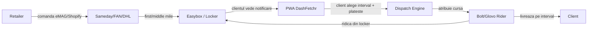
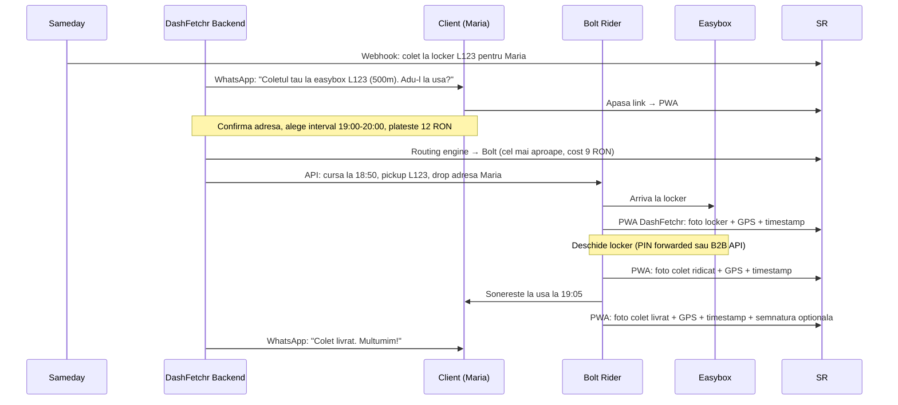
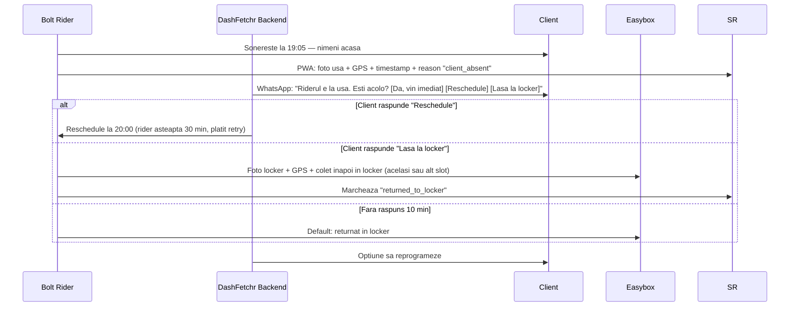
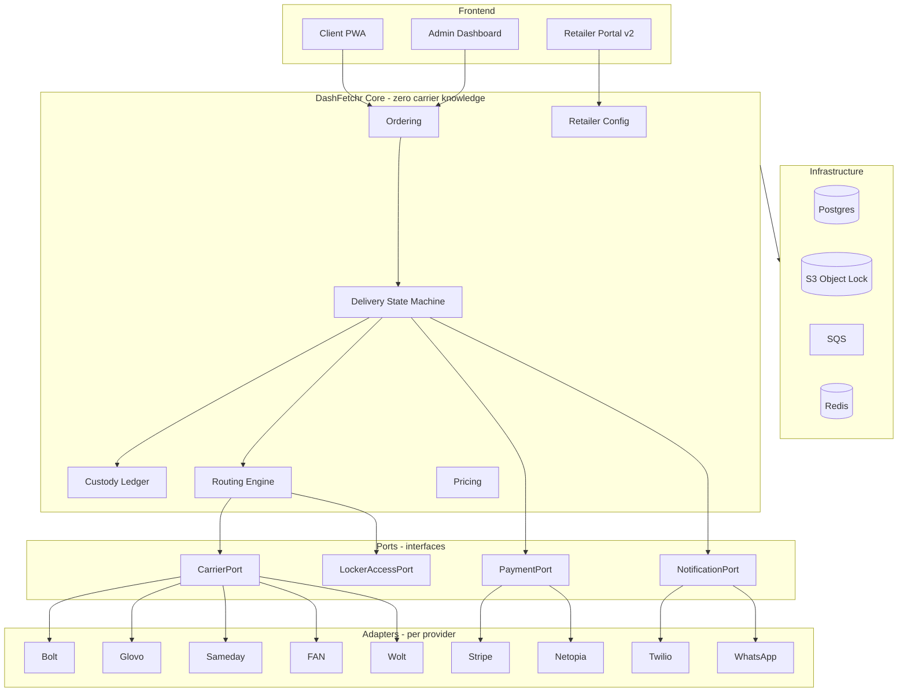

# DashFetchr — Product Document

**Version**: 1.0 (pre-kickoff)
**Status**: In review
**Audience**: Product Owner, Stakeholders, Tech Lead
**Last updated**: 2026-05-14

---

## Cuprins

1. [Sumar Executiv](#1-sumar-executiv)
2. [Modelul de Business](#2-modelul-de-business)
3. [Problema Rezolvata](#3-problema-rezolvata)
4. [Personas & User Flows](#4-personas--user-flows)
5. [Scope v1 — MVP (Luni 1-6)](#5-scope-v1--mvp-luni-1-6)
6. [Scope v2 — Multi-carrier (Luni 7-12)](#6-scope-v2--multi-carrier-luni-7-12)
7. [Chain of Custody (critical)](#7-chain-of-custody-critical)
8. [Integrari Curieri](#8-integrari-curieri)
9. [Arhitectura — sumar pentru produs](#9-arhitectura--sumar-pentru-produs)
10. [KPI & metrici de succes](#10-kpi--metrici-de-succes)
11. [Roadmap 12 luni](#11-roadmap-12-luni)
12. [Riscuri si mitigare](#12-riscuri-si-mitigare)
13. [Decizii necesare inainte de kickoff](#13-decizii-necesare-inainte-de-kickoff)

---

## 1. Sumar Executiv

**DashFetchr** este un serviciu *concierge* care aduce coletele de la easybox-uri la usa clientului final, pe intervalul ales de acesta. Functionam ca **middleware** intre reteaua existenta de easybox-uri (Sameday, easybox eMAG, FAN Courier etc.) si retele de curieri last-mile (Bolt Food, Glovo, Wolt, flote locale).

**Propunerea de valoare**:
- Pentru client: *"Coletul tau a ajuns la easybox-ul de la 500m. Pune-l la usa ta la 19:00, pentru 12 RON."*
- Pentru retailer: rata mai mica de livrari esuate, conversie crescuta la checkout, fara costuri fixe de logistica.
- Pentru curieri (Bolt/Glovo): volum constant in orele moarte, curse scurte si profitabile.

**Pozitionare**: serviciu **premium** pentru zone urbane dense cu venit mediu-superior (Floreasca, Primaverii, Pipera, Sector 1). Nu concuram cu Sameday sau Glovo — **completam** reteaua lor.

**Status financiar tinta**:
- Pilot (Luni 1-3): 50-100 livrari, validare manuala
- Tractiune (Luni 4-6): 100-150 comenzi/zi, marja unitara aproape de break-even
- Scale (Luni 10-12): 500-600 comenzi/zi, marja pozitiva 2-5 RON/comanda

---

## 2. Modelul de Business

### Flux de baza (v1)

### Ce face DashFetchr concret

1. Detecteaza ca un colet a ajuns la easybox (via tracking eMAG/Sameday sau via clientul care lipeste AWB).
2. Notifica clientul (WhatsApp/SMS): *"Coletul tau e la easybox-ul X. Vrei sa ti-l aducem la usa? Apasa aici."*
3. Clientul alege un interval (ex. 19:00-20:00) si plateste in PWA-ul nostru.
4. Sistemul atribuie un rider Bolt/Glovo prin API-ul lor B2B.
5. Riderul ridica din locker (cu cod, partener Sameday sau PIN forwarded de client).
6. Riderul livreaza la usa, face poza + GPS + timestamp, marcheaza livrat.
7. Notificare push catre client cu confirmarea.

### Surse de venit

| Sursa | Detalii | Aplicat in |
|---|---|---|
| **Fee per livrare (client)** | 10-15 RON, in functie de distanta si interval | v1 |
| **SaaS fee retailer** | 199-499 EUR/luna pentru retaileri integrati, > 100 comenzi/luna | v2 |
| **Comision de la curier** | Negociat pe volum, 1-2 RON / cursa | v2 |
| **Premium features** | Subscriptie client (5 livrari/luna, 49 RON), prioritate, bundling | v2 |
| **Return service** | Ridicam coletele de retur de la client → locker. 15 RON. | v3 |

### Unit economics target (la volum)

| Element | Valoare (RON) | Note |
|---|---|---|
| Pret platit de client | 12-15 | Subscriptie reduce la 10 |
| Cost rider Bolt/Glovo | 7-12 | Distanta scurta (0.5-2km) |
| Cost stocare locker (alocat) | 0-1 | Locker existent, nu noi platim |
| Cost esec amortizat (5% rate) | 0.5-1 | Locker buffer reduce rate-ul |
| Payment processing (3%) | 0.4-0.5 | |
| Platform cost (infra+suport) | 1-2 | |
| **Marja bruta target** | **+2 la +5** | Pozitiv de la inceput potentialmente |

> **Nota**: in modelul locker → casa, distantele sunt mult mai scurte (0.5-2 km) decat in modelul direct (3-8 km). Asta inseamna costuri Bolt/Glovo de 7-12 RON in loc de 15-25 RON. **Marja bruta poate fi pozitiva chiar din primele luni**, spre deosebire de modelul original din pitch deck.

---

## 3. Problema Rezolvata

### Pain point principal

> *"Mi-a venit coletul la easybox-ul de la 500m, dar n-am chef sa cobor la 22:00 sub ploaie. Daca nu il iau in 48h, se intoarce la depot si eu trebuie sa platesc reexpedierea."*

### Pain points secundare

- **Pentru client**: programul lockerelor (24/7) nu se aliniaza cu disponibilitatea fizica (oameni cu serviciu, copii, varstnici, mobilitate redusa).
- **Pentru retailer**: 5-10% din colete se intorc la depot pentru ca clientul nu le ridica. Cost dublu pentru retailer (reexpediere + reverse logistics).
- **Pentru curieri (Bolt/Glovo)**: capacitate moarta intre orele 10-12 si 14-17, cand cererea food drops.

### De ce acum

- Reteaua de easybox-uri din Bucuresti a depasit 1.500 puncte (Sameday 800+, eMAG 400+, FAN 200+, Postal 200+) - infrastructura e construita.
- Penetrarea easybox-urilor in eMAG: ~30% din comenzile Bucuresti, in crestere.
- Comportament cumparatori urbani: 60%+ comanda online, 40%+ raporteaza "lack of time" ca top friction.
- Capacitate Bolt/Glovo subutilizata in non-peak hours (date publice marketing Bolt).

---

## 4. Personas & User Flows

### 4.1 Persona — Maria, 32 ani, Floreasca

- Project manager intr-o multinationala. Castiga 8.000 RON net/luna.
- Comanda online 4-6x/luna pe eMAG (cosmetice, electronice, haine).
- Alege easybox pentru ca "e mai ieftin si nu mai astept curier la usa".
- **Frustarea ei**: jumatate din comenzi le ridica cu o intarziere de 2-4 zile, uneori le pierde si trebuie sa plateasca reexpedierea.
- **Willingness to pay**: confirmata in cercetari informale ~10-15 RON pentru "livrare la usa intr-un interval ales".

### 4.2 Persona — Andrei, 28 ani, rider Bolt

- 35-50 curse / zi pe food.
- Intre 10-12 si 14-17 are *"dead time"*. Cauta orice cursa.
- Pentru el o cursa DashFetchr e ideala: distanta scurta (0.5-2 km), payment garantat, fara mancare calda (mai relaxat).

### 4.3 Persona — eMAG marketplace seller (retailer pilot)

- Comerciant de cosmetice/farmacie, vinde 200-500 comenzi/luna in Bucuresti.
- Rata de esec actuala: ~8% (colete neridicate din easybox).
- Cost de reexpediere: 12-15 RON per colet neridicat. Pierdere directa.
- **Willingness to integrate**: ridicat daca dovedim reducere de 50%+ a esecurilor + integrare in < 1 zi.

### 4.4 User Flow principal — Client

### 4.5 User Flow secundar — Esec livrare

---

## 5. Scope v1 — MVP (Luni 1-6)

### 5.1 In scope (must-have)

#### Functional
- [x] **Onboarding client**: client lipeste AWB Sameday/eMAG sau scaneaza QR. DashFetchr detecteaza cand coletul ajunge la locker.
- [x] **PWA client**: branded DashFetchr, no app required, accesibila prin link SMS/WhatsApp.
- [x] **Programare interval**: clientul alege un slot de 1h din lista predefinita (urmatoarele 24h).
- [x] **Plata in PWA**: Stripe + Netopia, card + Apple/Google Pay.
- [x] **Dispatch automat catre 1 last-mile carrier** (Bolt Food sau Glovo, decis in Decisions doc).
- [x] **Acces locker**: prin PIN forwarding (client il copiaza din eMAG si il introduce in DashFetchr, sau e auto-extras din webhook Sameday daca avem parteneriat).
- [x] **Chain of Custody**: foto + GPS + timestamp la pickup din locker si la livrare la client.
- [x] **Notificari client**: WhatsApp Business API + fallback SMS (Twilio).
- [x] **Admin dashboard MVP**: lista comenzi live, override manual, vizualizare poze POD, capacity per zona.
- [x] **Audit log**: append-only event ledger cu hash chain.

#### Non-functional
- [x] Disponibilitate API > 99.5% in orele active (08:00-22:00)
- [x] Latenta P95 < 500ms pentru endpoints critice (dispatch, status)
- [x] GDPR compliance: PII clientilor doar in DB criptat, fara log-uri
- [x] PCI-DSS via Stripe/Netopia (nu stocam date card)

#### Geografie
- [x] Sector 1 (Floreasca, Primaverii, Aviatorilor, Pipera) — pilot
- [x] ~50-100 easybox-uri targetate
- [x] Ore de serviciu: 09:00 - 22:00 (extindere la 24/7 in v2 daca cererea o cere)

### 5.2 Out of scope (v1)

- ❌ Multi-carrier last-mile (un singur carrier in v1)
- ❌ Multi-carrier first-mile (Sameday la inceput, FAN/DHL in v2)
- ❌ Self-serve retailer onboarding (manual prin contact direct)
- ❌ Return service (livrare inversa)
- ❌ Subscriptii client
- ❌ ML routing (regula simpla: cel mai aproape rider disponibil)
- ❌ Multi-city (doar Bucuresti)
- ❌ Programare > 24h in avans
- ❌ Bundling multi-package (un colet per cursa)

### 5.3 Stories prioritare (MoSCoW)

**Must**
- US-001: Ca client, vreau sa programez livrarea unui colet din locker la usa mea, intr-un interval ales, platind in browser, fara sa instalez vreo aplicatie.
- US-002: Ca rider Bolt, vreau sa primesc o cursa scurta cu pickup la locker si drop la adresa client, si sa pot uploada poza la pickup si delivery.
- US-003: Ca operator DashFetchr, vreau un dashboard cu toate cursele active, statusul lor, pozele POD si optiune de redispatch manual.
- US-004: Ca sistem, vreau sa stochez fiecare eveniment custody intr-un ledger imutabil cu foto+GPS+timestamp.

**Should**
- US-005: Ca client, vreau sa primesc notificare WhatsApp cand coletul ajunge la locker, cu CTA clar.
- US-006: Ca client, in caz de esec, vreau sa pot reprograma sau cere sa fie pus inapoi in locker.

**Could**
- US-007: Ca retailer pilot, vreau sa vad un raport simplu cu livrarile DashFetchr facute pe coletele mele.

**Won't** (v1)
- Self-serve retailer onboarding, subscriptii, return service, multi-city.

---

## 6. Scope v2 — Multi-carrier (Luni 7-12)

### 6.1 Adaugiri functionale

- **Multi-carrier last-mile**: Bolt + Glovo + Wolt + flote locale ca backup.
- **Multi-carrier first-mile**: Sameday + FAN + DHL + Postal + eMAG Cargus.
- **Routing engine**: alege carrier-ul optim per cursa pe baza de:
  - Cost
  - ETA
  - Success rate istoric
  - Capacitate disponibila in zona
  - Preferinta retailerului (overrideable)
- **Self-serve retailer portal**: onboarding, settings SLA, dashboard analytics, integrare API/webhook.
- **Subscriptie client**: 49 RON/luna = 5 livrari incluse (fara extra fee).
- **Bundling**: livrare multi-package la aceeasi adresa cu pret redus.
- **Return service**: clientul programeaza ridicare din casa → locker pentru retur eMAG/etc.
- **B2B locker access**: parteneriat formal Sameday (in loc de PIN forwarding) — depinde de pilot.

### 6.2 Stack technical changes

- Pasaj de la SQS la Kafka (volum > 100 events/sec)
- Caching agresiv (Redis): capabilities carriers, zone calculations, pricing
- Read replicas Postgres pentru analytics
- ClickHouse sau Timescale pentru event analytics

---

## 7. Chain of Custody (critical)

**Critical pentru**: dovada in dispute, audit legal, calitate operationala, training ML.

### 7.1 Evenimente urmarite

| Eveniment | Cine emite | Foto | GPS | Timestamp | Comentariu |
|---|---|---|---|---|---|
| `package.dropped_at_locker` | Sameday (webhook) | ✓ (de la ei) | ✓ | ✓ | Trigger pentru notificare client |
| `pickup.requested_by_customer` | Client (via PWA) | — | — | ✓ | Intent + payment |
| `rider.assigned` | DashFetchr | — | — | ✓ | + rider_id, carrier |
| `rider.arrived_at_locker` | Rider (PWA DashFetchr) | ✓ locker | ✓ | ✓ | Verificare GPS ≤ 50m de locker |
| `package.picked_up` | Rider (PWA DashFetchr) | ✓ colet in mana | ✓ | ✓ | + AWB match |
| `rider.in_transit` | Rider device (auto) | — | ✓ (5s ping) | ✓ | Pentru tracking live |
| `rider.arrived_at_destination` | Rider (PWA / auto) | — | ✓ | ✓ | Verificare GPS ≤ 30m de adresa |
| `package.delivered` | Rider (PWA DashFetchr) | ✓ colet la usa | ✓ | ✓ | Optional semnatura |
| `delivery.failed` | Rider (PWA DashFetchr) | ✓ usa/locatie | ✓ | ✓ | + reason code obligatoriu |
| `package.returned_to_locker` | Rider (PWA DashFetchr) | ✓ locker | ✓ | ✓ | Pentru flow esec |

### 7.2 Reguli de integritate

- Toate evenimentele sunt **imutabile** (append-only).
- Fiecare eveniment contine hash-ul evenimentului precedent (Merkle chain). **Imposibil de modificat istoric fara detectie.**
- Pozele sunt stocate in **S3 cu Object Lock (compliance mode)** — nici noi nu le putem sterge timp de 7 ani.
- GPS-ul are camp `accuracy_m`. Daca > 100m, evenimentul e marcat ca "low_confidence".
- Server timestamp (NTP-synced) este sursa de adevar. Timestamp-ul carrier-ului e stocat separat pentru reconciliere.

### 7.3 Cum forcam carrier-ul sa faca poza

Carrier-ul (Bolt/Glovo) nu poate marca *"delivered"* in sistemul nostru fara upload de poza prin PWA-ul DashFetchr. Daca Bolt zice in API-ul lui "delivered" dar n-avem poza, statusul nostru ramane *"awaiting_confirmation"* iar plata nu se elibereaza catre client (refund automat dupa 30 min daca nu vine confirmarea).

---

## 8. Integrari Curieri

### 8.1 Carriers tinta

| Carrier | Rol | v1 | v2 | API status (cunoscut public) |
|---|---|---|---|---|
| **Sameday** | First/middle mile, locker network | ✓ (tracking webhook) | ✓ (B2B locker access ideal) | API documentat, sandbox disponibil |
| **Bolt Food** | Last-mile | ✓ (target principal) | ✓ | B2B API exista, necesita acord comercial |
| **Glovo** | Last-mile | optional alt | ✓ | "Couriers as a service" API |
| **Wolt** | Last-mile | — | ✓ | Wolt Drive API (B2B) |
| **FAN Courier** | First/middle mile | — | ✓ | API public |
| **DHL Romania** | First/middle mile (premium) | — | ✓ | API REST documentat |
| **eMAG Cargus** | First/middle mile | — | ✓ | Acces via eMAG marketplace |
| **Flote locale** | Last-mile backup | — | ✓ (custom) | Custom integration |

### 8.2 Cum adaugam un curier nou (fara breaking changes)

Vezi [ADDING_A_CARRIER.md](ADDING_A_CARRIER.md). TL;DR:

1. Implementezi interface-ul `CarrierPort` (5 metode).
2. Mapezi `Capabilities()` cu ce poate face carrier-ul.
3. Scrii un Anti-Corruption Layer (mapper carrier API ↔ domain).
4. Inregistrezi adapter-ul in `registry`.
5. Treci contract tests-urile automate (~30 scenarii standard).
6. **Zero modificari in core domain.** Routing engine-ul preia automat noul carrier.

---

## 9. Arhitectura — sumar pentru produs

### 9.1 Principii

- **Hexagonal (Ports & Adapters)**: domeniul nostru e izolat de orice carrier specific.
- **DDD Bounded Contexts**: separare clara intre Ordering, Delivery, Custody, Routing, Pricing, Retailer.
- **Event-driven**: orice schimbare de stare produce evenimente in event bus. Consum de mai multi consumeri.
- **Plugin architecture pentru carriers**: adaugi/elimini fara redeploy core.

### 9.2 Diagrama high-level

### 9.3 De ce aceste alegeri

| Decizie | Motiv |
|---|---|
| Go (vs Node.js) pentru backend core | Concurrency naturala, latenta mica, ideal pentru orchestrare carrier API-uri paralele |
| Modulith (vs microservicii) la inceput | Velocity in MVP. Spargem in microservicii cand bounded contexts se stabilizeaza (Luna 10+). |
| Postgres (vs MySQL) | JSONB pentru payload-uri carrier variabile, partial indexes, NOTIFY/LISTEN |
| S3 Object Lock | Compliance + audit legal (poze imutabile 7 ani) |
| Event-driven cu SQS | Decoupling, retry-uri robuste, audit gratuit |
| PWA (vs app nativa) | Zero friction client, no install, link from SMS/WhatsApp |
| Hexagonal + ACL per carrier | Adaugi/schimbi carrier-uri fara sa rupi nimic in core |

Vezi [ARCHITECTURE.md](ARCHITECTURE.md) pentru detalii tehnice.

---

## 10. KPI & metrici de succes

### 10.1 Metrici de produs

| Metric | Definitie | Target M3 | Target M6 | Target M12 |
|---|---|---|---|---|
| **Comenzi/zi** | Numar livrari finalizate | 5-10 | 100 | 500 |
| **Conversie locker→client** | % notificari → comenzi platite | > 5% | > 10% | > 15% |
| **Rata succes la prima incercare** | Delivered fara reschedule | > 92% | > 95% | > 97% |
| **Time-to-delivery P50** | De la programare la livrat | < 90 min | < 60 min | < 45 min |
| **Time-to-delivery P95** | Coada lunga | < 180 min | < 120 min | < 90 min |
| **NPS client** | Sondaj post-livrare | > 40 | > 50 | > 60 |
| **% interval slot respectat** | Livrat in fereastra promisa | > 85% | > 92% | > 95% |

### 10.2 Metrici operationali

| Metric | Target M6 | Target M12 |
|---|---|---|
| Cost per livrare (all-in) | < 13 RON | < 11 RON |
| Marja bruta per livrare | > 1 RON | > 3 RON |
| Capacity utilization rider | > 60% | > 75% |
| Eroare API carrier | < 1% | < 0.3% |
| Latenta P95 dispatch | < 5 sec | < 2 sec |
| Disponibilitate platforma | > 99.5% | > 99.9% |

### 10.3 Metrici de business

| Metric | Target M6 | Target M12 |
|---|---|---|
| Retaileri activi integrati | 2 | 8+ |
| Volum lunar (comenzi) | 3.000 | 15.000+ |
| MRR (Monthly Recurring Revenue) | 0 € | 5.000+ € |
| CAC client | < 5 € | < 3 € |
| LTV/CAC | > 5 | > 8 |

### 10.4 Surse de date pentru benchmarking pre-pilot

- **eMAG**: rapoarte vendor pentru sellers parteneri (rata esec colete, time-to-delivery actual, returns)
- **Sameday**: utilizare easybox-uri Bucuresti (publice partial), rata "retrieved within 48h"
- **Date publice**: rapoarte ANCOM, INS (Institutul National de Statistica) pe e-commerce Romania
- **Sondaje proprii**: 200+ raspunsuri target clienti Sector 1 (Typeform + ads FB)

---

## 11. Roadmap 12 luni

| Luna | Faza | Livrabile cheie | Target volum |
|---|---|---|---|
| **M0** | Validare + parteneriate | Demand/supply map, LOI Sameday + Bolt + 1 retailer, decizii Sectiunea 13 | — |
| **M1-M2** | MVP foundation | Order, Custody, Routing core, Bolt adapter, PWA client, payment Stripe, admin dashboard minimal | 10-20 (wizard of oz) |
| **M3** | Pilot Floreasca | 1 retailer pilot, 50 easybox-uri targetate, primele 500 comenzi totale | 5-10/zi |
| **M4** | Iteratii | Glovo ca backup carrier, refinements UX, WhatsApp Business prod | 30-50/zi |
| **M5** | Sector 1 extins | + Primaverii, Aviatorilor, Pipera. Sameday locker B2B partnership (target). 2 retaileri activi | 60-100/zi |
| **M6** | Stabilizare v1 | KPI > target, marja unitara aproape 0, audit complet, security review | 100-150/zi |
| **M7-M8** | Multi-carrier v2 | FAN + DHL first-mile, Wolt last-mile, routing engine inteligent | 200-300/zi |
| **M9** | Retailer Portal | Self-serve onboarding, API publica, plugin Shopify | 300-400/zi |
| **M10-M11** | Scale Bucuresti | 5+ retaileri, multi-zone, subscriptii client, return service beta | 400-500/zi |
| **M12** | Pregatire Series A | KPI target M12 atinse, due diligence pack, pregatire Cluj/Timisoara | 500+/zi |

---

## 12. Riscuri si mitigare

| Risc | Probabilitate | Impact | Mitigare |
|---|---|---|---|
| **Acces locker fara parteneriat Sameday** | Ridicata | Critic | Pilot cu PIN forwarding (functioneaza azi). Negociere paralela cu Sameday cu date din pilot. Backup: rugam clientul sa coboare colet la "drop zone" lobby. |
| **Bolt/Glovo nu vor parteneriat B2B** | Medie | Mare | Pilot cu rideri freelance Bolt (subcontracting individual). Backup: angajam 5-10 rideri full-time pe ora salarizati pentru pilot. |
| **Cerere mai mica decat estimata** | Medie | Mare | Pricing dinamic, prima livrare gratuita, marketing local (postare pe FB Floreasca, flyere in cladiri). |
| **Sameday vrea sa faca ei serviciul** | Medie | Mare | Diferentierea prin neutralitate (vor folosi toate retelele) + lock-in pe partea de software/UX. |
| **Carrier API instabil / breaking changes** | Ridicata | Mediu | Adapter versioning (vezi ARCHITECTURE), contract tests, feature flags pentru rollback. |
| **Failed deliveries la usa client** | Medie | Mediu | Slot interval ales de client (reduce esec). Reschedule automat. Fallback locker. |
| **Disputa colet pierdut / avariat** | Scazuta | Mediu | Chain of custody cu hash chain + S3 Object Lock — dovada criptografica. Asigurare comerciala. |
| **Regulatory: ANCOM, protectia consumatorului** | Medie | Mediu | Consultanta legala in M1. Statut juridic clar: intermediar tehnic, nu transportator. |
| **GDPR breach** | Scazuta | Critic | Criptare la rest + tranzit, PII minimal, audit anual, DPO desemnat. |
| **Cash flow negativ prelungit** | Medie | Critic | Seed round 250k EUR confirmat inainte de M1. Burn lunar tinta < 18k EUR. |

---

## 13. Decizii necesare inainte de kickoff

> **Acestea sunt deciziile care necesita sign-off de la product owner si stakeholders inainte sa scriem prima linie de cod productie.** Vezi [DECISIONS.md](DECISIONS.md) pentru fiecare decizie cu optiuni, pros/cons, recomandarea mea.

Lista scurta (full detalii in DECISIONS.md):

1. **Modelul principal pentru pilot**: doar locker→casa (premium concierge) sau si home delivery direct?
2. **Plata client**: in PWA DashFetchr (recomandat) sau inclusa in pretul retailer la checkout?
3. **Acces locker pentru pilot**: PIN forwarding (rapid) vs negociere prelungita Sameday B2B (sigur, lent)?
4. **Primul last-mile carrier**: Bolt Food sau Glovo? (pe care il integram primul)
5. **Geografie pilot**: doar Floreasca sau Floreasca + Primaverii + Aviatorilor?
6. **Limba PWA & comunicare**: doar RO sau RO + EN?
7. **Stack frontend final**: Next.js confirmare?
8. **Limbaj backend**: Go pur sau Go + Node.js BFF?
9. **Cine e in echipa la kickoff**: 1 backend senior + 1 frontend + 1 ops? Cine angajeaza, cand?
10. **Budget infra**: AWS account dedicat, organisation setup, IAM, billing alerts.

---

## Approval

| Rol | Nume | Decizie | Data | Semnatura |
|---|---|---|---|---|
| Product Owner | _______________ | ☐ Approved &nbsp;&nbsp; ☐ Changes needed | __________ | __________ |
| Tech Lead | _______________ | ☐ Approved &nbsp;&nbsp; ☐ Changes needed | __________ | __________ |
| Founder / CEO | _______________ | ☐ Approved &nbsp;&nbsp; ☐ Changes needed | __________ | __________ |

---

*Document confidential. Toate informatiile sunt proprietatea DashFetchr.*
